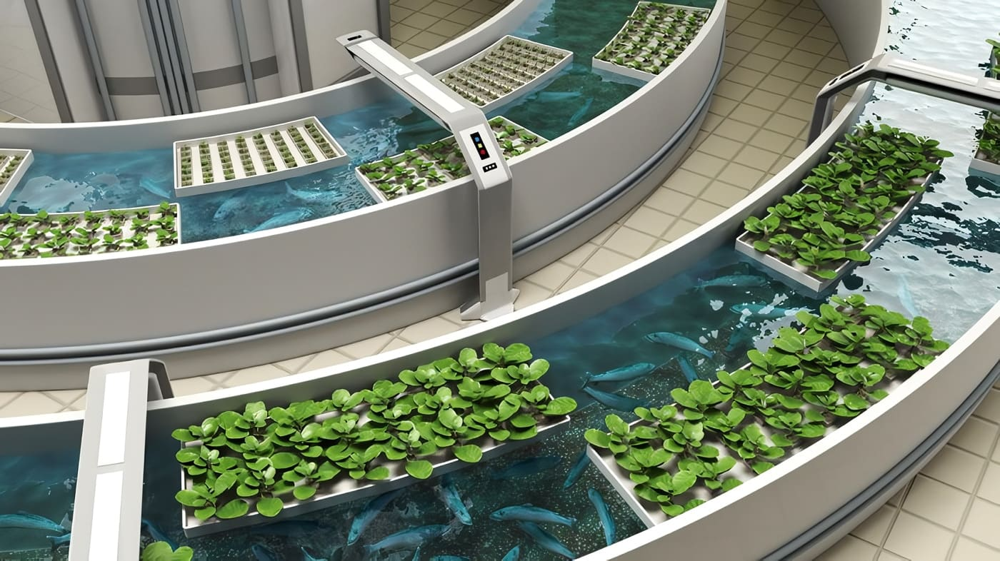
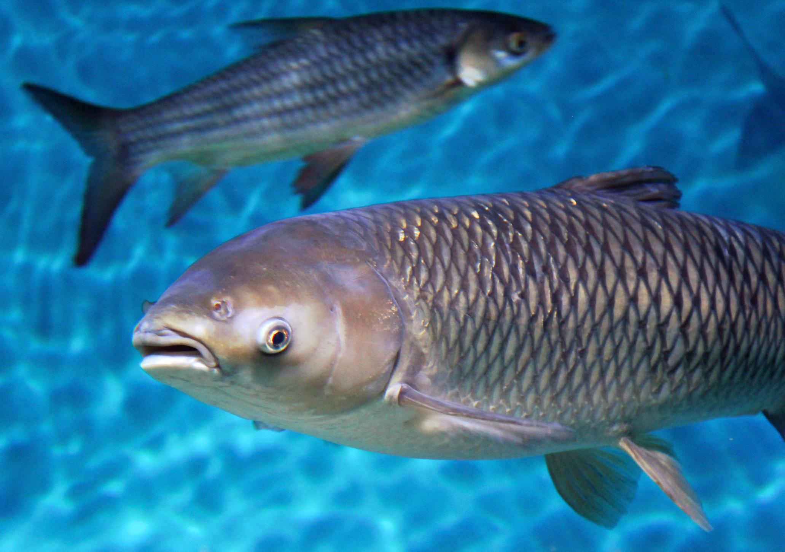
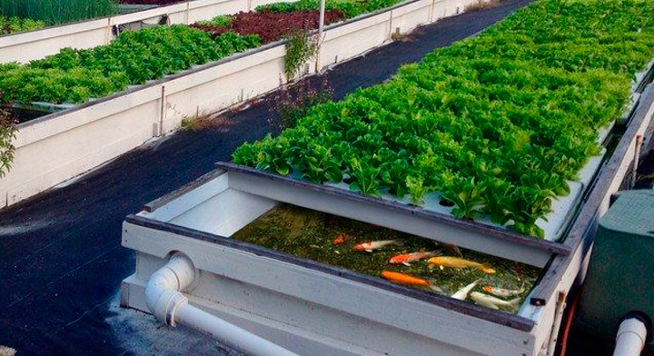
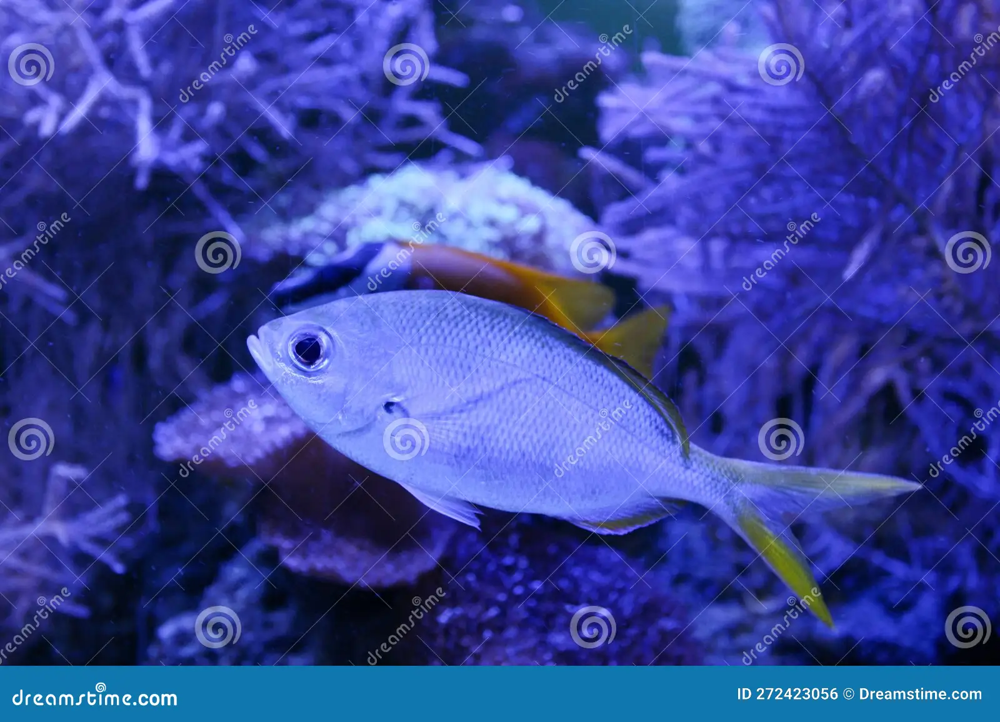
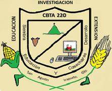

<!DOCTYPE html>
<html lang="es">
<head>
    <meta charset="UTF-8">
    <meta name="viewport" content="width=device-width, initial-scale=1.0">
    <title>Mi Sitio Web</title>
    <link rel="stylesheet" href="slider.css">
    <link rel="stylesheet" href="estilo.css">
    
</head>
<body>
    
 
        <ul> 
            <li></li>
            <li></li>
            <li></li>
            <li></li>
        </ul>
    

    <nav style="display: flex; justify-content: center; gap: 20px; margin: 20px 0;">
        

            <a href="inicio.html">Inicio</a>
        

        

            <a href="galeria.html">Galería</a>
        

        

            <a href="preguntas-frecuentes.html">Preguntas Frecuentes</a>
        

        

            <a href="contactos.html">Contacto</a>
        

        

            <a href="Proceso%20de%20Instalacion.html">Proceso de Instalacion</a>
        

        

            <a href="informacion2y4.html">Informacion 2 y 4 semestre</a>
        

         

            <a href="Recursos%20Adicionales.html">Recursos Adicionales</a>
        

    </nav>
    <header> 
        <h1>ACUAPONIA 
             "INOVACION SOSTENIBLE EN LA PRODUCCION DE ALIMENTOS"</h1>
    </header>
   <article style="background-color: #f0f8ff; border: 7px solid #add8e6; border-radius: 20px; padding: 15px; width: 1000px; text-align: center; margin: 20px auto; display: flex; align-items: center; gap: 15px;">
    
    

        <h2>¿Quienes somos?</h2>
        
   
            Somos un equipo de estudiantes del Centro de Bachillerato Tecnológico Agropecuario No. 220 (CBTA 220), que a través de este sitio web promovemos la difusión y presentación del innovador Proyecto de Acuaponía llevado a cabo en nuestra institución educativa. Este sistema propone soluciones sostenibles a los desafíos ambientales actuales mediante la combinación de la cría de peces y el cultivo de plantas en un modelo eficiente y respetuoso con el medio ambiente.

El Proyecto de Acuaponía optimiza el uso de los recursos naturales y fomenta prácticas responsables, reflejando el compromiso de nuestra institución con la educación y la sostenibilidad. Esta iniciativa contribuye significativamente al bienestar de nuestra comunidad y del planeta.
        

    

</article>

</body>
</html>
